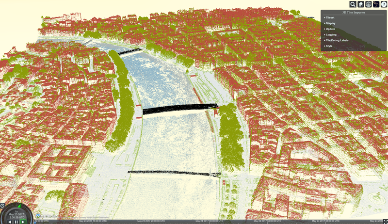
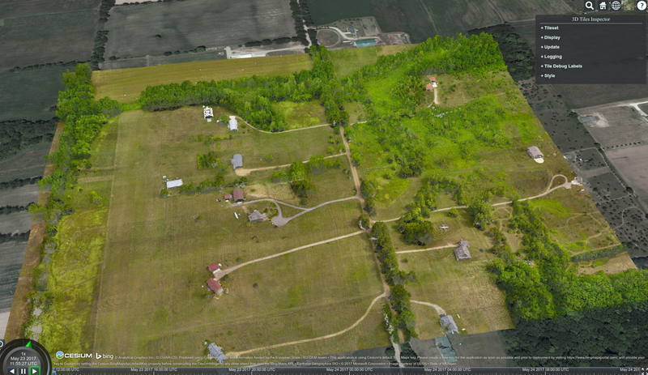
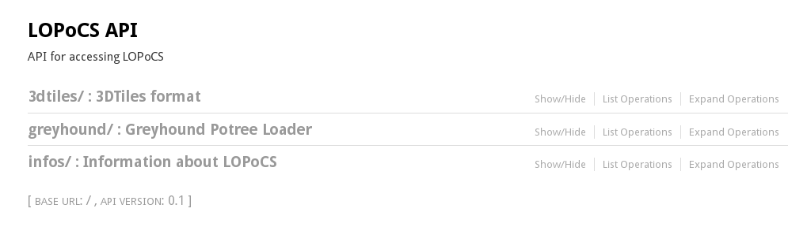

Light Opensource |logo| PointCloud Server
#########################################

|unix_build| |license|

LOPoCS is a point cloud server written in
Python, allowing to load Point Cloud from a PostgreSQL database thanks to the ``pgpointcloud``
extension.

The current version of LOPoCS provides a way to load Point Cloud from PostgreSQL to the following viewers:

* `Cesium <https://github.com/AnalyticalGraphicsInc/cesium>`_ thanks to the `3DTiles <https://github.com/AnalyticalGraphicsInc/3d-tiles>`_ format
* `Potree viewer <http://www.potree.org/>`_ : viewer with LAZ compressed data.

Note that LOPoCS is currently the only **3DTiles** server able to stream data from
`pgpointcloud <https://github.com/pgpointcloud/pointcloud>`_. This
is possible thanks to the python module
`py3dtiles <https://github.com/Oslandia/py3dtiles>`_.

Developments are still going on to improve state-of-the-art algorithms and
performances.

`Video <https://vimeo.com/189285883>`_

`Online demonstration <https://oslandia.github.io/lopocs>`_

Example using 3Dtiles/Cesium with data from `GrandLyon <https://data.grandlyon.com/imagerie/points-lidar-2015-du-grand-lyon/>`_

.. contents::

.. section-numbering::

Main features
=============

* Command line tool to load data into PostgreSQL
* Swagger API
* Stream patches stored in PostgreSQL
* Greyhound protocol support
* 3DTiles standard support (partial)
* Produce ready to use examples with Potree and Cesium

Installation
============

Dependencies
------------

  - python >= 3.4
  - gdal development headers (libgdal-dev)
  - pip (python3-pip)
  - virtualenv (python3-virtualenv)
  - `pgpointcloud <https://github.com/pgpointcloud/pointcloud>`_ with lazperf enabled
  - `Morton Postgres extension <https://github.com/Oslandia/pgmorton>`_
  - `PDAL <https://github.com/PDAL/PDAL/>`_ (used by the LOPoCS loader)

.. note:: The LOPoCS loader uses PDAL's "mortonorder" filter in "reverse" mode. The "reverse" mode was introduced in PDAL version 1.7.1, so make sure you use this version or higher.

From sources
------------

.. code-block:: bash

    $ git clone https://github.com/Oslandia/lopocs
    $ cd lopocs
    $ virtualenv -p /usr/bin/python3 venv
    $ source venv/bin/activate
    (venv)$ pip install 'numpy==1.14.3'
    (venv)$ pip install -e .

Configuration
=============

You will find an example of a configuration file for lopocs in ``conf/lopocs.sample.yml``

You have to copy it to ``conf/lopocs.yml`` and fill with your values, lopocs will load it
if this file exists.
Another alternative is to set up the ``LOPOCS_SETTINGS`` environment variable to locate your configuration file.

Usage
=====

Prepare database
----------------

.. code-block:: bash

  $ createdb lopocs
  $ psql -d lopocs -c 'create extension postgis'
  $ psql -d lopocs -c 'create extension pointcloud'
  $ psql -d lopocs -c 'create extension pointcloud_postgis'
  $ psql -d lopocs -c 'create extension morton'

Lopocs CLI
----------

You can invoke lopocs in your virtualenv to show help and list available subcommands

.. code-block:: bash

    $ cd lopocs
    $ source venv/bin/activate
    (venv)$ lopocs

Check installation
------------------

.. code-block:: bash

    (venv)$ lopocs check
    Pdal ... 1.4.0
    Pdal plugin pgpointcloud ... ok
    PostgreSQL ... 9.6.3
    PostGIS extension ... 2.3.1
    PgPointcloud extension ... 1.1.0
    PgPointcloud-PostGIS extension ... 1.0

Demo data
---------

.. code-block:: bash

    (venv)$ mkdir demos
    (venv)$ lopocs demo --work-dir demos/ --sample airport --cesium
    (venv)$ lopocs serve

Copy/Paste the link at the end of the log in your browser and you will be able to see this:

Swagger API
-----------

Each viewer has specific expectations and communication protocol. So, the API is built to meet these specific needs.

Currently, 2 kinds of formats are supported:

  - 3DTiles
  - Greyhound format (LAZ data with a footer indicating the number of points)

LOPoCS is able to stream data up to 2 viewers:

  - Cesium with the 3DTiles format
  - Potree viewer with the Greyhound format

LOPoCS provides its RESTful API through a Swagger UI by default on
`<http://localhost:5000>`_

Run tests
=========

.. code-block:: bash

  (venv)$ pip install .[dev]
  (venv)$ py.test

Licence
=======

LGPL>2: `LICENSE <https://github.com/Oslandia/lopocs/blob/master/LICENSE>`_.

.. |unix_build| image:: https://img.shields.io/travis/Oslandia/lopocs/master.svg?style=flat-square&label=unix%20build
    :target: http://travis-ci.org/Oslandia/lopocs
    :alt: Build status of the master branch

.. |license| image:: https://img.shields.io/badge/license-LGPL-blue.svg?style=flat-square
    :target: LICENSE
    :alt: Package license
